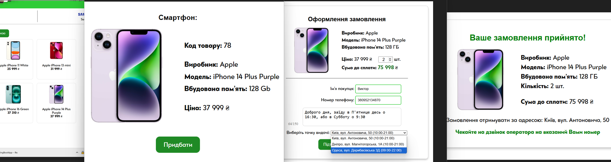
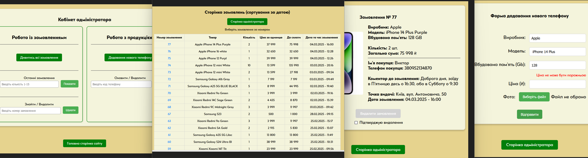

# "Online Shop"

## Description
This is the online store project with any brands and items.

---
## Features
Client: 
- can select a phone by brand
- sort phones by price within a brand
- view information about the phone (enlarge photo)
- place an order (select quantity, leave a comment on the order)

Site administrator:
- can add/delete phone
- change phone information
- view/delete orders

- 
General information:
- Information about products/users/orders is stored in the database. If a client registers, passwords are encrypted and the user role (ROLE_USER) is automatically set in the database. Product photos are stored in the project memory. Access to the administrator's office is only possible for a user with the ROLE_ADMIN status
---
## Technologies
- Framework: Spring Boot (Thymeleaf, Security, PostgreSQL, Lombok, Test, Validation)
- Backend: Java
- Frontend: HTML, CSS, JavaScript
---
## Usage
To run the project:

1. Build and run application in your IDE.
2. Open http://localhost:8080/mobileshop/ in your browser to view the application.
---
## Contributing
Contributions to the Life Flow Simulation project are welcome. Please follow these steps to contribute:

1. Fork the repository.
2. Create a new branch (git checkout -b feature-branch).
3. Make changes and commit (git commit -am 'Add some feature').
4. Push to the branch (git push origin feature-branch).
5. Create a new Pull Request.
---
## License
[Specify the license or if it's open source, you can include a standard license like MIT.]

---
## Contact
- Developer: Viktor Diakonov
- Email: diakonov.viktor.ua@gmail.com
- LinkedIn: 